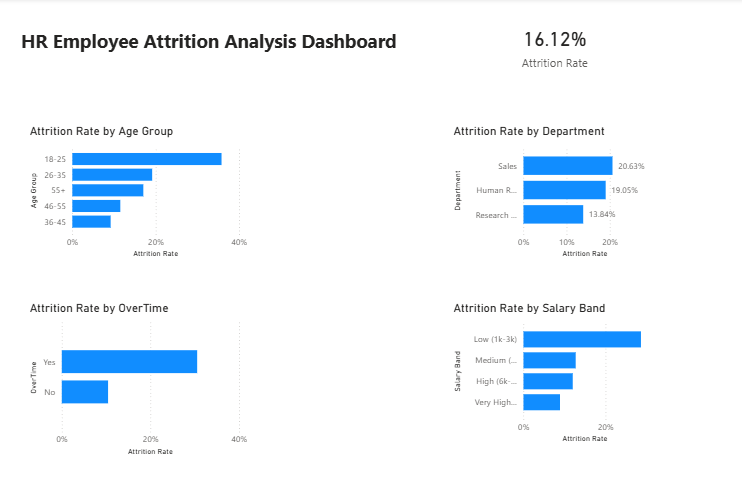

# HR Attrition Analysis (SQL Project)

## 📌 Project Overview
This project analyzes employee attrition using SQL on the IBM HR Employee Attrition dataset.  
The objective was to identify key factors contributing to employee turnover.

---

## 📊 Dataset
- IBM HR Employee Attrition Dataset
- Total Records: 1,470 employees
- Tool Used: MySQL

---

## 🎯 Objectives
- Calculate overall attrition rate
- Analyze attrition by department
- Identify impact of overtime on attrition
- Analyze attrition by age group
- Study relationship between salary range and employee exits

---

## 🛠 SQL Concepts Used
- SELECT
- GROUP BY
- CASE WHEN
- Aggregate Functions (COUNT, SUM, AVG)
- ORDER BY
- ROUND

---

## 📈 Key Insights
- Employees working overtime showed significantly higher attrition rates.
- Lower income groups had higher employee turnover.
- Certain departments experienced more exits compared to others.
- Mid-age groups showed noticeable attrition trends.

---

## 📂 Files Included
- `hr_attrition_analysis.sql` – SQL queries used for analysis
- `WA_Fn-UseC_-HR-Employee-Attrition.csv` – Dataset
- (Optional) Dashboard screenshot

---

## 📊 Dashboard Preview

## 🚀 Author
Krushna Budhe  
Krushna Budhe  
Data Analyst | SQL | Power BI | Excel  

